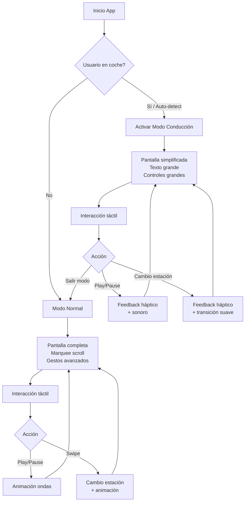

# Análisis UX/UI: Mejoras para ONDA Radio - Modo Conducción

## Resumen Ejecutivo

ONDA Radio es una aplicación web de streaming de radio con diseño mobile-first y estética minimalista. Si bien la interfaz actual es elegante y funcional para uso general, presenta **oportunidades significativas de mejora** para el contexto específico de conducción.

---

## 1. Análisis de la Interfaz Actual

### 1.1 Estructura de Pantallas

```
┌─────────────────────────────────┐
│  ● ONDA        London   14:32  │  ← Header (logo + ubicación + hora)
├─────────────────────────────────┤
│                                 │
│     ┌─────────────────────┐     │
│     │                     │     │
│     │     COVER ART       │     │  ← Área principal (click para play/pause)
│     │    (gradiente/      │     │
│     │     imagen)         │     │
│     │                     │     │
│     └─────────────────────┘     │
│                                 │
│  Canción actual • Artista ─────→│  ← Marquee scroll (NowPlaying)
│                                 │
└─────────────────────────────────┘
        ↑ Swipe vertical (up)
← Swipe →  horizontal (cambio estación)
```

### 1.2 Problemas Identificados para Uso en Coche

#### 🔴 Problemas Críticos (Alta Prioridad)

| Problema | Impacto en Conducción | Evidencia en Código |
|----------|----------------------|---------------------|
| **Texto demasiado pequeño** | Dificultad para leer información sin desviar la vista | [`font-size-m: 24px`](src/styles/global.css:27) para nombres de estación |
| **Área táctil insuficiente** | Miss-clicks peligrosos al intentar interactuar | Cover como único botón de play/pause sin área mínima 48x48dp |
| **Marquee scroll rápido** | Distracción visual constante | [`duration-slower: 20s`](src/styles/global.css:112) para texto completo |
| **Sin feedback táctil/háptico** | Incertidumbre sobre si la acción se ejecutó | Solo efecto `:active` con scale en CSS |
| **Falta modo conducción** | Demasiada información en pantalla | No existe alternativa simplificada de UI |

#### 🟡 Problemas Medios (Media Prioridad)

| Problema | Impacto | Contexto |
|----------|---------|----------|
| **Contraste variable** | Pérdida de legibilidad con luz solar | Dependencia de `prefers-color-scheme` sin modo manual |
| **Sin indicadores de swipe** | Usuario no descubre gestos fácilmente | No hay hints visuales para cambio de estación |
| **Falta volumen visual** | No se sabe el nivel de audio actual | Solo control nativo del sistema |
| **Info de estación limitada** | No se ve el género musical actual | [`genre`](src/data/stations.ts:9) existe pero no se muestra |

#### 🟢 Problemas Menores (Baja Prioridad)

- Animaciones de onda pueden ser distractoras en modo conducción
- No hay acceso rápido a favoritos o historial
- Sin integración con asistentes de voz

---

## 2. Propuestas de Mejora Priorizadas

### 2.1 🔴 Alta Prioridad: Modo Conducción (Car Mode)

#### Diseño Propuesto

```
┌─────────────────────────────────────────────────┐
│  🔆  ONDA Radio                    [SALIR]      │
├─────────────────────────────────────────────────┤
│                                                 │
│                                                 │
│           ┌─────────────────┐                   │
│           │                 │                   │
│           │   COVER ART     │                   │
│           │   (grande)      │                   │
│           │                 │                   │
│           └─────────────────┘                   │
│                                                 │
│        JAZZ SAKURA                              │
│        Kyoto, Japan                             │
│        ─────────────────────────────            │
│        Midnight in a Perfect World              │
│        DJ Shadow                                │
│                                                 │
├─────────────────────────────────────────────────┤
│                                                 │
│    [◀◀]        [⏯ PLAY]        [▶▶]            │
│                                                 │
│         ◀  SWIPE PARA CAMBIAR  ▶                │
│                                                 │
└─────────────────────────────────────────────────┘
```

#### Especificaciones Técnicas

```typescript
// src/components/screens/DrivingScreen.tsx
interface DrivingScreenProps {
  stationName: string;
  stationLocation: string;
  stationGenre?: string;
  trackTitle?: string;
  trackArtist?: string;
  coverImage?: string;
  isPlaying: boolean;
  onToggle: () => void;
  onNextStation: () => void;
  onPrevStation: () => void;
  onExitCarMode: () => void;
}
```

#### Cambios CSS Requeridos

```css
/* Modo Conducción - Estilos específicos */
.car-mode-container {
  --car-font-size-xl: 48px;      /* Títulos */
  --car-font-size-lg: 32px;      /* Subtítulos */
  --car-font-size-md: 24px;      /* Texto normal */
  --car-font-size-sm: 20px;      /* Metadata */
  
  --car-touch-min: 88px;         /* Área mínima táctil */
  --car-spacing: 24px;           /* Espaciado aumentado */
  
  background: #000;              /* Fondo siempre oscuro */
  color: #fff;                   /* Texto siempre claro */
}

.car-mode-button {
  min-width: var(--car-touch-min);
  min-height: var(--car-touch-min);
  border-radius: 50%;
  background: rgba(255, 255, 255, 0.15);
  border: 2px solid rgba(255, 255, 255, 0.3);
  display: flex;
  align-items: center;
  justify-content: center;
  font-size: 32px;
}

.car-mode-button:active {
  background: rgba(237, 63, 28, 0.8);  /* Color brand */
  transform: scale(0.95);
}
```

### 2.2 🔴 Alta Prioridad: Elementos Táctiles Grandes

#### Problema Actual
El cover art es el único elemento interactivo principal, pero no hay garantía de que sea suficientemente grande (mínimo 48x48dp según WCAG, recomendado 88x88dp para coche).

#### Solución Propuesta

```tsx
// Componente de controles mejorado
export const LargeTouchControls: React.FC<ControlsProps> = ({
  isPlaying,
  onToggle,
  onNext,
  onPrevious,
  showLabels = true
}) => (
  <div className="large-controls-container">
    <button 
      className="large-control-btn"
      onClick={onPrevious}
      aria-label="Estación anterior"
    >
      <span className="large-control-icon">◀◀</span>
      {showLabels && <span className="large-control-label">Anterior</span>}
    </button>
    
    <button 
      className="large-control-btn large-control-btn--primary"
      onClick={onToggle}
      aria-label={isPlaying ? "Pausar" : "Reproducir"}
    >
      <span className="large-control-icon">
        {isPlaying ? '⏸' : '▶'}
      </span>
    </button>
    
    <button 
      className="large-control-btn"
      onClick={onNext}
      aria-label="Siguiente estación"
    >
      <span className="large-control-icon">▶▶</span>
      {showLabels && <span className="large-control-label">Siguiente</span>}
    </button>
  </div>
);
```

### 2.3 🔴 Alta Prioridad: Feedback Visual y Sonoro

#### Implementación

```typescript
// src/hooks/useCarFeedback.ts
export function useCarFeedback() {
  const vibrate = useCallback((pattern: number | number[] = 50) => {
    if ('vibrate' in navigator) {
      navigator.vibrate(pattern);
    }
  }, []);

  const playSound = useCallback((type: 'success' | 'error' | 'click') => {
    // Audio context para feedback sonoro
    const audioContext = new (window.AudioContext || (window as any).webkitAudioContext)();
    const oscillator = audioContext.createOscillator();
    const gainNode = audioContext.createGain();
    
    oscillator.connect(gainNode);
    gainNode.connect(audioContext.destination);
    
    switch (type) {
      case 'success':
        oscillator.frequency.value = 800;
        gainNode.gain.setValueAtTime(0.1, audioContext.currentTime);
        gainNode.gain.exponentialRampToValueAtTime(0.01, audioContext.currentTime + 0.1);
        oscillator.start(audioContext.currentTime);
        oscillator.stop(audioContext.currentTime + 0.1);
        break;
      case 'click':
        oscillator.frequency.value = 400;
        gainNode.gain.setValueAtTime(0.05, audioContext.currentTime);
        oscillator.start(audioContext.currentTime);
        oscillator.stop(audioContext.currentTime + 0.05);
        break;
    }
  }, []);

  return { vibrate, playSound };
}
```

### 2.4 🟡 Media Prioridad: Mejoras de Accesibilidad

#### Contraste y Legibilidad

```css
/* Mejoras de accesibilidad para modo conducción */
@media (prefers-contrast: high) {
  .car-mode-container {
    --car-text-primary: #fff;
    --car-text-secondary: #ccc;
    --car-accent: #ff6b4a;  /* Brand más brillante */
    
    text-shadow: 0 2px 4px rgba(0, 0, 0, 0.8);
  }
  
  .car-mode-button {
    border-width: 3px;
    border-color: #fff;
  }
}

/* Reducir movimiento para usuarios sensibles */
@media (prefers-reduced-motion: reduce) {
  .car-mode-container * {
    animation: none !important;
    transition: none !important;
  }
}
```

#### Texto Escalable

```tsx
// Componente de texto con tamaño ajustable
export const ScalableText: React.FC<{
  children: React.ReactNode;
  level: 'title' | 'subtitle' | 'body';
  className?: string;
}> = ({ children, level, className }) => {
  const sizeClass = {
    title: 'text-scalable-title',      /* 48px base */
    subtitle: 'text-scalable-subtitle', /* 32px base */
    body: 'text-scalable-body'          /* 24px base */
  }[level];
  
  return (
    <span className={`${sizeClass} ${className || ''}`}>
      {children}
    </span>
  );
};
```

### 2.5 🟡 Media Prioridad: Indicadores de Gestos

```tsx
// Indicador visual de que se pueden hacer swipe
export const SwipeHint: React.FC = () => {
  const [visible, setVisible] = useState(true);
  
  useEffect(() => {
    const timer = setTimeout(() => setVisible(false), 5000);
    return () => clearTimeout(timer);
  }, []);
  
  if (!visible) return null;
  
  return (
    <div className="swipe-hint-container" aria-hidden="true">
      <div className="swipe-hint-left">
        <span className="swipe-hint-arrow">◀</span>
        <span className="swipe-hint-text">Anterior</span>
      </div>
      <div className="swipe-hint-right">
        <span className="swipe-hint-text">Siguiente</span>
        <span className="swipe-hint-arrow">▶</span>
      </div>
    </div>
  );
};
```

### 2.6 🟢 Baja Prioridad: Integraciones Adicionales

- **Soporte para controles del volante** vía Media Session API (ya parcialmente implementado)
- **Detección automática de modo coche** (conexión Bluetooth de coche)
- **Soporte para Android Auto / Apple CarPlay** (Web-based)

---

## 3. Especificaciones Técnicas Detalladas

### 3.1 Estructura de Componentes Propuesta

```
src/
├── components/
│   ├── screens/
│   │   ├── PlayingScreen.tsx          (existente)
│   │   ├── WaitingScreen.tsx          (existente)
│   │   └── DrivingScreen.tsx          (nuevo)
│   ├── ui/
│   │   ├── NowPlaying.tsx             (existente)
│   │   ├── LargeTouchControls.tsx     (nuevo)
│   │   ├── ScalableText.tsx           (nuevo)
│   │   ├── SwipeHint.tsx              (nuevo)
│   │   └── CarModeToggle.tsx          (nuevo)
│   └── feedback/
│       └── HapticFeedback.tsx         (nuevo)
├── hooks/
│   ├── audio/
│   ├── media/
│   └── car/
│       ├── useCarMode.ts              (nuevo)
│       ├── useCarFeedback.ts          (nuevo)
│       └── useAutoCarDetection.ts     (nuevo)
└── styles/
    ├── global.css
    ├── animations.css
    └── car-mode.css                   (nuevo)
```

### 3.2 Hook: useCarMode

```typescript
// src/hooks/car/useCarMode.ts
import { useState, useEffect, useCallback } from 'react';

interface CarModeState {
  isCarMode: boolean;
  isAutoDetected: boolean;
  enterCarMode: () => void;
  exitCarMode: () => void;
}

export function useCarMode(): CarModeState {
  const [isCarMode, setIsCarMode] = useState(false);
  const [isAutoDetected, setIsAutoDetected] = useState(false);

  // Detectar conexión Bluetooth de coche (si está disponible)
  useEffect(() => {
    if ('bluetooth' in navigator) {
      // @ts-ignore - API experimental
      navigator.bluetooth.getAvailability().then(available => {
        if (available) {
          // Intentar detectar dispositivos de coche
          // Esto es un ejemplo simplificado
        }
      });
    }
  }, []);

  // Persistir preferencia en localStorage
  useEffect(() => {
    const saved = localStorage.getItem('onda-car-mode');
    if (saved === 'true') {
      setIsCarMode(true);
    }
  }, []);

  const enterCarMode = useCallback(() => {
    setIsCarMode(true);
    localStorage.setItem('onda-car-mode', 'true');
    // Forzar orientación landscape si es posible
    if (screen.orientation && screen.orientation.lock) {
      screen.orientation.lock('landscape').catch(() => {});
    }
  }, []);

  const exitCarMode = useCallback(() => {
    setIsCarMode(false);
    localStorage.setItem('onda-car-mode', 'false');
    if (screen.orientation && screen.orientation.unlock) {
      screen.orientation.unlock();
    }
  }, []);

  return {
    isCarMode,
    isAutoDetected,
    enterCarMode,
    exitCarMode
  };
}
```

### 3.3 CSS: car-mode.css

```css
/* src/styles/car-mode.css */

/* ==========================================================================
   Car Mode - Variables
   ========================================================================== */
:root {
  /* Tamaños de fuente aumentados para visibilidad en coche */
  --car-font-title: clamp(36px, 8vw, 64px);
  --car-font-subtitle: clamp(24px, 5vw, 40px);
  --car-font-body: clamp(20px, 4vw, 28px);
  --car-font-small: clamp(16px, 3vw, 20px);
  
  /* Áreas táctiles mínimas (88px recomendado para coche) */
  --car-touch-small: 64px;
  --car-touch-medium: 88px;
  --car-touch-large: 120px;
  
  /* Espaciado aumentado */
  --car-spacing-xs: 12px;
  --car-spacing-sm: 20px;
  --car-spacing-md: 32px;
  --car-spacing-lg: 48px;
  
  /* Colores optimizados para visibilidad */
  --car-bg-primary: #000000;
  --car-bg-secondary: #1a1a1a;
  --car-text-primary: #ffffff;
  --car-text-secondary: #cccccc;
  --car-accent: #ED3F1C;
  --car-accent-hover: #ff5c3a;
  --car-border: rgba(255, 255, 255, 0.3);
}

/* ==========================================================================
   Car Mode - Layout
   ========================================================================== */
.car-mode {
  position: fixed;
  top: 0;
  left: 0;
  right: 0;
  bottom: 0;
  background: var(--car-bg-primary);
  color: var(--car-text-primary);
  display: flex;
  flex-direction: column;
  padding: var(--car-spacing-md);
  z-index: 9999;
  overflow: hidden;
}

/* Header simplificado */
.car-mode__header {
  display: flex;
  justify-content: space-between;
  align-items: center;
  padding-bottom: var(--car-spacing-sm);
  border-bottom: 1px solid var(--car-border);
}

.car-mode__brand {
  font-size: var(--car-font-body);
  font-weight: 600;
  display: flex;
  align-items: center;
  gap: var(--car-spacing-xs);
}

.car-mode__brand::before {
  content: '🚗';
  font-size: var(--car-font-subtitle);
}

/* Área principal del contenido */
.car-mode__content {
  flex: 1;
  display: flex;
  flex-direction: column;
  justify-content: center;
  align-items: center;
  gap: var(--car-spacing-md);
  padding: var(--car-spacing-md) 0;
}

/* Cover art grande y central */
.car-mode__cover {
  width: min(50vh, 60vw);
  height: min(50vh, 60vw);
  max-width: 400px;
  max-height: 400px;
  border-radius: 24px;
  overflow: hidden;
  position: relative;
  box-shadow: 0 8px 32px rgba(0, 0, 0, 0.5);
}

.car-mode__cover-image {
  width: 100%;
  height: 100%;
  object-fit: cover;
}

.car-mode__cover-placeholder {
  width: 100%;
  height: 100%;
  background: linear-gradient(135deg, #4a60a2 0%, #1e1e1e 100%);
}

/* Información de la estación y track */
.car-mode__info {
  text-align: center;
  max-width: 100%;
}

.car-mode__station {
  font-size: var(--car-font-subtitle);
  font-weight: 600;
  margin-bottom: var(--car-spacing-xs);
  white-space: nowrap;
  overflow: hidden;
  text-overflow: ellipsis;
}

.car-mode__location {
  font-size: var(--car-font-body);
  color: var(--car-text-secondary);
  margin-bottom: var(--car-spacing-sm);
}

.car-mode__track {
  font-size: var(--car-font-body);
  font-weight: 500;
  white-space: nowrap;
  overflow: hidden;
  text-overflow: ellipsis;
  max-width: 90vw;
}

.car-mode__artist {
  font-size: var(--car-font-small);
  color: var(--car-text-secondary);
  white-space: nowrap;
  overflow: hidden;
  text-overflow: ellipsis;
  max-width: 90vw;
}

/* Controles grandes y táctiles */
.car-mode__controls {
  display: flex;
  justify-content: center;
  align-items: center;
  gap: var(--car-spacing-md);
  padding: var(--car-spacing-md) 0;
}

.car-mode__btn {
  min-width: var(--car-touch-medium);
  min-height: var(--car-touch-medium);
  border-radius: 50%;
  background: var(--car-bg-secondary);
  border: 2px solid var(--car-border);
  color: var(--car-text-primary);
  font-size: var(--car-font-body);
  display: flex;
  align-items: center;
  justify-content: center;
  cursor: pointer;
  transition: all 0.2s ease;
  -webkit-tap-highlight-color: transparent;
}

.car-mode__btn--primary {
  min-width: var(--car-touch-large);
  min-height: var(--car-touch-large);
  background: var(--car-accent);
  border-color: var(--car-accent);
  font-size: var(--car-font-subtitle);
}

.car-mode__btn:active {
  transform: scale(0.95);
  background: var(--car-accent-hover);
}

.car-mode__btn--primary:active {
  box-shadow: 0 0 20px var(--car-accent);
}

/* Indicadores de swipe */
.car-mode__swipe-hint {
  display: flex;
  justify-content: space-between;
  padding: var(--car-spacing-sm) var(--car-spacing-lg);
  font-size: var(--car-font-small);
  color: var(--car-text-secondary);
  opacity: 0.6;
}

/* ==========================================================================
   Responsive - Landscape optimizado
   ========================================================================== */
@media (orientation: landscape) {
  .car-mode {
    flex-direction: row;
    padding: var(--car-spacing-lg);
  }
  
  .car-mode__header {
    position: absolute;
    top: var(--car-spacing-md);
    left: var(--car-spacing-md);
    right: var(--car-spacing-md);
    border-bottom: none;
  }
  
  .car-mode__content {
    flex-direction: row;
    gap: var(--car-spacing-lg);
  }
  
  .car-mode__cover {
    width: min(70vh, 40vw);
    height: min(70vh, 40vw);
  }
  
  .car-mode__info-section {
    flex: 1;
    display: flex;
    flex-direction: column;
    justify-content: center;
    align-items: flex-start;
    text-align: left;
    padding-left: var(--car-spacing-lg);
  }
  
  .car-mode__info {
    text-align: left;
    margin-bottom: var(--car-spacing-lg);
  }
  
  .car-mode__station,
  .car-mode__track,
  .car-mode__artist {
    max-width: 45vw;
  }
}

/* ==========================================================================
   Accesibilidad
   ========================================================================== */
@media (prefers-contrast: high) {
  .car-mode__btn {
    border-width: 3px;
    border-color: #fff;
  }
  
  .car-mode__track,
  .car-mode__station {
    text-shadow: 0 2px 4px rgba(0, 0, 0, 0.8);
  }
}

@media (prefers-reduced-motion: reduce) {
  .car-mode *,
  .car-mode *::before,
  .car-mode *::after {
    animation-duration: 0.01ms !important;
    animation-iteration-count: 1 !important;
    transition-duration: 0.01ms !important;
  }
}

/* ==========================================================================
   Focus states para navegación por teclado
   ========================================================================== */
.car-mode__btn:focus-visible {
  outline: 3px solid var(--car-accent);
  outline-offset: 4px;
}
```

---

## 4. Consideraciones de Seguridad Vial

### 4.1 Principios de Diseño para Conducción

1. **Los 2 Segundos**: Ninguna interacción debe requerir más de 2 segundos de atención visual
2. **Una Mirada**: La información crítica debe ser legible en una sola mirada rápida
3. **Sin Texto en Movimiento**: El marquee actual debe pausarse o simplificarse en modo coche
4. **Feedback Inmediato**: Cada acción debe tener confirmación visual/táctil instantánea

### 4.2 Checklist de Seguridad

- [ ] Texto mínimo 24px (preferiblemente 32px+)
- [ ] Áreas táctiles mínimo 88x88px
- [ ] Contraste 4.5:1 mínimo (7:1 preferido)
- [ ] Sin animaciones distractoras
- [ ] Controles accesibles sin mirar (posición memorizable)
- [ ] Feedback háptico en cada interacción
- [ ] Modo "No molestar" automático

### 4.3 Integración con Sistemas del Coche

```typescript
// Detección de conexión a sistema de coche
export function useCarConnection() {
  const [isConnectedToCar, setIsConnectedToCar] = useState(false);

  useEffect(() => {
    // Detectar si el audio está saliendo por Bluetooth de coche
    if ('audioSession' in navigator) {
      // @ts-ignore
      navigator.audioSession?.addEventListener('typechange', (e) => {
        // @ts-ignore
        const type = navigator.audioSession?.type;
        setIsConnectedToCar(type === 'play-and-record' || type === 'ambient');
      });
    }

    // Fallback: detectar cambios en el contexto de audio
    const audio = document.querySelector('audio');
    if (audio) {
      audio.addEventListener('play', () => {
        // Verificar si hay dispositivos de salida de audio
        if ('devicePixelRatio' in window) {
          // Heurística simple
        }
      });
    }
  }, []);

  return isConnectedToCar;
}
```

---

## 5. Plan de Implementación

### Fase 1: Fundamentos (Sprint 1)
- [ ] Crear componente `DrivingScreen` con layout básico
- [ ] Implementar hook `useCarMode`
- [ ] Crear hoja de estilos `car-mode.css`
- [ ] Agregar toggle de modo coche en UI

### Fase 2: Interacción (Sprint 2)
- [ ] Implementar `LargeTouchControls` con áreas táctiles ampliadas
- [ ] Agregar feedback háptico y sonoro
- [ ] Crear indicadores de swipe
- [ ] Optimizar tipografía escalable

### Fase 3: Inteligencia (Sprint 3)
- [ ] Detección automática de conexión de coche
- [ ] Persistencia de preferencias
- [ ] Mejoras de accesibilidad (contraste alto, reduced motion)
- [ ] Soporte para landscape y diferentes tamaños de pantalla

### Fase 4: Pulido (Sprint 4)
- [ ] Testing en dispositivos reales
- [ ] Optimización de rendimiento
- [ ] Documentación de usuario
- [ ] Analytics de uso del modo coche

---

## 6. Métricas de Éxito

| Métrica | Baseline | Target | Cómo Medir |
|---------|----------|--------|------------|
| Tiempo de interacción | ~3-4s | <2s | Testing de usuario |
| Tasa de error | Desconocida | <5% | Analytics de interacción |
| Satisfacción | N/A | >4/5 | Encuestas de usuario |
| Uso modo coche | 0% | >30% usuarios activos | Analytics |
| Accesibilidad | N/A | WCAG 2.1 AA | Auditoría automática |

---

## 7. Diagrama de Flujo de Usuario



---

## 8. Conclusión

Las mejoras propuestas transforman ONDA Radio de una aplicación generalista a una experiencia optimizada para conducción, manteniendo su esencia minimalista pero priorizando:

1. **Seguridad**: Menor distracción visual, controles grandes
2. **Accesibilidad**: Texto escalable, alto contraste, feedback multi-modal
3. **Usabilidad**: Interfaz simplificada, gestos intuitivos, detección inteligente

La implementación modular permite desplegar características gradualmente y medir su impacto antes de continuar con funcionalidades más avanzadas.
